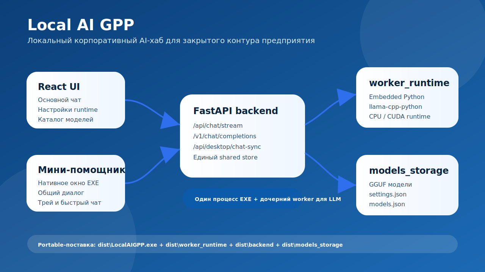
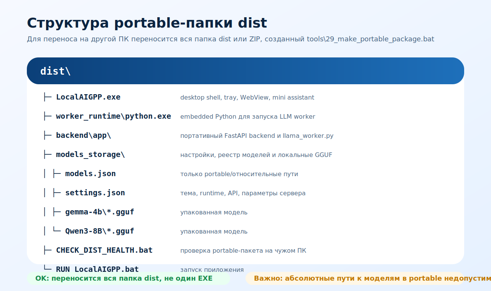

# Local AI GPP

**Local AI GPP** — локальный корпоративный AI-хаб для запуска LLM-моделей и управления моделями в закрытом контуре предприятия. Проект ориентирован на работу без внешних облачных API: модели, настройки, история диалогов и runtime находятся внутри локального окружения или portable-поставки.



## Что умеет

- запуск локальных LLM-моделей в формате **GGUF** через `llama-cpp-python`;
- основной чат с потоковой генерацией ответа;
- OpenAI-compatible endpoint: `./v1/chat/completions`;
- нативный мини-помощник рядом с основным интерфейсом;
- единая история диалогов между основным чатом и мини-помощником;
- несколько диалогов с переключением и очисткой активного диалога;
- portable-сборка для переноса на другой компьютер;
- хранение моделей, настроек, логов и branding-ресурсов внутри проекта/поставки;
- проверочные bat-скрипты для сборки, smoke-test и диагностики portable-пакета.

## Интерфейс

Мини-помощник работает как нативное окно desktop-версии и синхронизируется с основным чатом через общий desktop sync store.


## Основная структура проекта

```text
local_ai_gpp_2/
├─ backend/                 # FastAPI backend, runtime, llama worker
├─ frontend/                # React/Vite интерфейс
├─ models_storage/          # настройки, реестр моделей, branding, локальные модели
├─ tools/                   # bat/py скрипты запуска, сборки и проверок
├─ docs/                    # документация и изображения
├─ docker-compose.yml       # docker-запуск backend + frontend
└─ README.md
```

## Быстрый запуск в режиме разработки

```bat
tools\01_run_local_browser.bat
```

Запускаются:

```text
Backend:  http://127.0.0.1:8000
Frontend: http://127.0.0.1:5173
```

Для полной переустановки окружения:

```bat
tools\01_run_local_browser.bat --setup
```

Для освобождения стандартных портов перед запуском:

```bat
tools\01_run_local_browser.bat --reset-ports
```

## Сборка desktop EXE

CPU-сборка:

```bat
tools\02_build_exe.bat --cpu
```

CUDA-сборка, если подготовлен совместимый CUDA runtime/wheel:

```bat
tools\02_build_exe.bat --cuda cu124
```

После сборки результат находится в:

```text
dist\LocalAIGPP.exe
```

Но для LLM-приложения важен не один EXE, а вся portable-папка `dist`.

## Portable-поставка



В portable-поставку входят:

```text
dist/
├─ LocalAIGPP.exe
├─ worker_runtime/
├─ backend/
├─ models_storage/
├─ CHECK_DIST_HEALTH.bat
├─ RUN_LocalAIGPP.bat
└─ README_PORTABLE_DIST.txt
```

Для проверки portable-структуры на машине сборки:

```bat
tools\28_check_dist_portable.bat
```

Для упаковки всей папки `dist` в ZIP:

```bat
tools\29_make_portable_package.bat
```

ZIP будет создан в:

```text
tools\out\LocalAIGPP_portable_dist_*.zip
```

На другом компьютере нужно распаковать ZIP и сначала запустить:

```bat
CHECK_DIST_HEALTH.bat
```

Затем:

```bat
RUN_LocalAIGPP.bat
```

> Важно: переносить нужно всю папку `dist`, а не только `LocalAIGPP.exe`. Модели, backend и embedded Python runtime лежат рядом с EXE.

## Модели

Поддерживаемый основной формат для LLM:

```text
*.gguf
```

Модели регистрируются через интерфейс или через `models_storage/models.json`.

Для portable-сборки пути к моделям должны быть относительными и указывать внутрь `dist/models_storage`:

```text
models_storage\gemma-4b\gemma-3-4b-it-Q4_K_M.gguf
```

Недопустимо оставлять в portable-сборке абсолютные пути исходной машины:

```text
C:\Users\...\.lmstudio\models\...
E:\...
```

Проверка `tools\28_check_dist_portable.bat` должна выявлять такие ошибки.

## Проверки после сборки

После сборки рекомендуется выполнить:

```bat
tools\09_smoke_test_exe.bat
tools\28_check_dist_portable.bat
```

После запуска `dist\LocalAIGPP.exe`:

```bat
tools\27_check_desktop_sync_contract.bat
```

`27_check_desktop_sync_contract.bat` проверяет, что основной чат и мини-помощник используют один desktop sync store, а не две разные истории.

## Docker-запуск

```bat
tools\03_build_docker.bat
```

Контейнеры:

```text
local_ai_gpp_backend   -> 127.0.0.1:8000
local_ai_gpp_frontend  -> 127.0.0.1:8080
```

## Логи

Логи запросов и runtime находятся в:

```text
logs/
dist\logs/
tools\out/
```

В интерфейсе у ответа можно открыть лог выполнения запроса.


## Назначение проекта

Проект предназначен для закрытого контура предприятия, где нельзя полагаться на публичные облачные LLM-сервисы. Local AI GPP даёт локальный интерфейс, локальное хранение моделей и возможность переносить готовую desktop-поставку между рабочими местами.

## License

This project is licensed under the MIT License. See the [LICENSE](LICENSE) file for details.