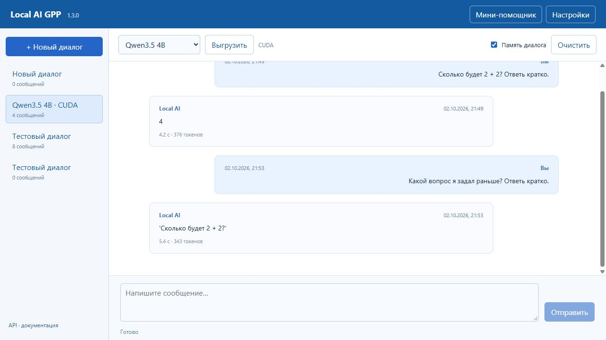

<div align="center">
  
  <h1>Local AI GPP</h1>
  <p><strong>Ваш мини-помощник. Ваши модели. Локальный inference.</strong></p>
  <p>
    <a href="https://github.com/wladsergeew013-glitch/local_ai_gpp/actions/workflows/ci.yml"></a>
    
    
    
    <a href="LICENSE"></a>
  </p>
  <p><a href="docs/API.md">API</a> · <a href="docs/DOCKER.md">Docker</a> · <a href="examples/client.py">Пример приложения</a> · <a href="docs/VALIDATION.md">Результаты проверок</a></p>
</div>

Local AI запускает GGUF-модели на вашем компьютере и предоставляет OpenAI-compatible API другим приложениям. Основной интерфейс — Windows EXE с мини-помощником и общей историей. В браузере — компактный сине-белый чат с отдельными диалогами.



## Возможности

- **Мини-помощник:** скрываемый список диалогов, создание и выбор беседы, дата и время сообщений, иконка в трее.
- **Чат с памятью:** отдельная история каждой беседы, поток ответа, переключатель памяти, сохранение ручной прокрутки.
- **Контекст:** пресеты и свой размер, резерв токенов на ответ, оценка заполнения перед отправкой и автоматическое сокращение старых реплик без удаления истории. Если текущий вопрос не помещается, ошибка показывает лимит и способы исправления.
- **Загрузка без блокировки окна:** мини-помощник можно двигать и переключать диалоги, пока модель загружается. Координаты и размеры учитывают рабочую область его монитора. Кнопка загрузки выполняет пробное вычисление до статуса готовности.
- **Три режима Windows:** CPU, CPU + CUDA, CUDA. Диагностика показывает фактическое число слоёв на GPU и причину fallback.
- **Qwen без длинных рассуждений:** адаптер использует штатный переключатель GGUF-шаблона; рассуждения отключены по умолчанию и включаются в настройках или API.
- **Стабильный runtime:** отдельный постоянный worker, ограниченные timeout, отмена генерации и восстановление после ошибки.
- **Подключение приложений:** `/v1/models`, `/v1/chat/completions`, стандартный SSE, история с `memory=true/false`.
- **Linux:** Docker Compose с CPU или NVIDIA CUDA runtime, healthcheck, постоянным хранилищем и read-only подключением папки GGUF.

## Быстрый старт · Windows

Нужны Python 3.12 и Node.js 22. Для CUDA нужна NVIDIA GPU с достаточной свободной видеопамятью.

```powershell
git clone https://github.com/wladsergeew013-glitch/local_ai_gpp.git
cd local_ai_gpp
py -3.12 -m venv backend/.venv
backend/.venv/Scripts/python.exe -m pip install -r backend/requirements.txt
cd frontend
npm ci
npm run build
cd ..
powershell -ExecutionPolicy Bypass -File tools/run_local.ps1
```

Откройте **http://127.0.0.1:8765**, подключите `.gguf` по пути или загрузите файлом. Можно использовать файл из папки LM Studio: копировать модель для локальной регистрации не требуется. Схема API: **http://127.0.0.1:8765/docs**.

Для CUDA установите runtime и выберите режим в настройках:

```bat
tools\06_install_cuda_runtime.bat cu124 0.3.36
```

### Собрать EXE

```powershell
py -3.12 tools/02_build_exe.py
# Явно собрать CUDA-поставку, в том числе на машине без GPU:
py -3.12 tools/02_build_exe.py --cuda cu124
# CPU-поставка:
py -3.12 tools/02_build_exe.py --cpu
```

При обнаружении NVIDIA сборщик автоматически выбирает CUDA. CUDA wheel и необходимые DLL устанавливаются в embedded runtime до замены EXE; сборка останавливается, если GPU offload не подтверждён. CUDA Toolkit на целевой машине не нужен: необходимые runtime DLL входят в поставку, нужен совместимый драйвер NVIDIA. Флаг `--cpu` явно отключает CUDA.

Запускайте `dist/LocalAIGPP.exe`. Переносите **всю папку dist**, включая `worker_runtime`, `backend`, `models_storage` и файлы моделей. Проверка поставки: `dist/CHECK_DIST_HEALTH.bat`. Для упаковки: `tools/29_make_portable_package.bat`.

Готовая Windows-поставка с CUDA: [релиз 1.4.0](https://github.com/wladsergeew013-glitch/local_ai_gpp/releases/tag/v1.4.0). Распакуйте архив целиком и запустите `LocalAIGPP.exe`; модели GGUF подключаются через интерфейс. Контекст по умолчанию — 4096, максимум на ответ — 512, смешанный режим использует 8 GPU-слоёв. В настройках можно выбрать CPU или другое число слоёв.

Для публичного архива используйте `py -3.12 tools/29_make_portable_package.py --release`: он включает EXE и runtime, чистые настройки и реестр, исключает локальные модели, историю и логи. Обычная упаковка без `--release` сохраняет модели и настройки для переноса вашего рабочего экземпляра.

EXE поднимает API сам. При занятом порте используйте уже запущенный экземпляр или закройте его штатно через меню трея.

## Быстрый старт · Linux / Docker

Нужен Docker Engine с Compose v2. Образ содержит CPU runtime; файлы моделей подключаются отдельно.

```bash
git clone https://github.com/wladsergeew013-glitch/local_ai_gpp.git
cd local_ai_gpp
export LOCAL_AI_MODELS_DIR=/absolute/path/to/gguf-folder
docker compose up -d --build --wait
```

| Адрес | Назначение |
|---|---|
| http://127.0.0.1:8080 | Веб-чат и API через Nginx |
| http://127.0.0.1:8080/v1 | Base URL для приложений |
| http://127.0.0.1:18765/docs | API напрямую / Swagger |

В настройках чата укажите путь **внутри контейнера**, например `/models/Qwen3.5-4B-Q4_K_M.gguf`, и выберите CPU. История браузера остаётся в браузере; реестр, настройки и логи сервера — в Docker volume. [Порты, хранение и проверка inference →](docs/DOCKER.md)

Для NVIDIA GPU на Linux x86_64 установите совместимый драйвер и NVIDIA Container Toolkit, затем запустите CUDA-вариант:

```bash
docker compose -f docker-compose.yml -f docker-compose.gpu.yml up -d --build --wait
```

В настройках выберите CUDA, CPU + CUDA или CPU. API и адреса остаются теми же. [Подготовка хоста, проверка GPU и примеры →](docs/DOCKER.md#запуск-с-nvidia-gpu)

## Подключить своё приложение

Сначала получите точный ID зарегистрированной модели:

```bash
curl http://127.0.0.1:8765/v1/models
```

Отправьте вопрос:

```bash
curl http://127.0.0.1:8765/v1/chat/completions \
  -H 'Content-Type: application/json' \
  -d '{"model":"Qwen3.5 4B:Qwen3.5-4B-Q4_K_M.gguf","messages":[{"role":"user","content":"Привет! Ответь кратко."}],"max_tokens":512,"memory":true,"stream":false,"chat_template_kwargs":{"enable_thinking":false}}'
```

Для Docker замените адрес на `http://127.0.0.1:8080`. ID берётся из `/v1/models`, имя файла в примере — для нашей проверочной модели. В PowerShell используйте `curl.exe` или готовый Python-клиент.

### Python · приложение с памятью

[examples/client.py](examples/client.py) использует только стандартную библиотеку Python, поддерживает SSE, хранит историю и сообщает о незавершённом ответе.

Сначала запустите Local AI и зарегистрируйте GGUF. Получите точный ID через `GET /v1/models` и передайте его в `model`:

```python
from examples.client import LocalAI

ai = LocalAI(
    base_url="http://127.0.0.1:8765/v1",
    model="Qwen3.5 4B:Qwen3.5-4B-Q4_K_M.gguf",  # Точный ID из /v1/models
    memory=True,
    enable_thinking=False,  # Qwen отвечает без режима рассуждений
)

# Обе реплики идут одной модели; клиент передаёт историю диалога.
print(ai.ask("Запомни: мой проект называется ORBIT."))
print(ai.ask("Как называется мой проект?"))

# Та же модель и сервер, отдельный клиент без памяти:
other = LocalAI(base_url=ai.base_url, model=ai.model, memory=False, enable_thinking=False)
print(other.ask("Сколько будет два плюс два?"))
```

Все `ai.ask()` используют ID, выбранный при создании клиента. Если модель ещё не загружена, сервер загрузит её при первом запросе. Для Docker укажите `base_url="http://127.0.0.1:8080/v1"`.

Для Qwen `enable_thinking=False` явно отключает рассуждения, `True` включает их. Клиент передаёт этот флаг как `chat_template_kwargs.enable_thinking` при каждом запросе. Без параметра используется настройка модели/сервера; в Local AI она по умолчанию выключена. [Готовые примеры Python, curl и native API](docs/API.md#qwen-прямой-ответ-и-рассуждения).

Если `model` опустить, Python-клиент сам запрашивает `/v1/models` и выбирает **первую модель в списке**. Текущий выбор в веб-чате или мини-помощнике на этот выбор не влияет. Посмотреть ID клиента: `print(ai.model)`. Для приложения с несколькими моделями указывайте `model` явно.

```bash
python examples/client.py --model "Qwen3.5 4B:Qwen3.5-4B-Q4_K_M.gguf" --no-thinking --stream
python examples/client.py --model "Qwen3.5 4B:Qwen3.5-4B-Q4_K_M.gguf" --no-thinking --no-memory --prompt "Привет!"
python examples/client.py --base-url http://127.0.0.1:8080/v1 --model "ID из /v1/models" --max-tokens 512
```

API не хранит беседы: для продолжения передавайте предыдущие `messages`; `memory=false` исключает историю. При включённых рассуждениях Qwen в историю следует включать только финальный ответ — пример клиента это делает.

### VetConsult

Провайдер: **openai_compat**. Base URL: **http://127.0.0.1:8765/v1**. Model: точный ID из `/v1/models`. Для Docker — **http://127.0.0.1:8080/v1**.

[Пример подключения](examples/vetconsult_connection.json) · [Страница настройки через обычную сессию VetConsult](examples/vetconsult_connector.html) · [Проверка штатного клиента](tools/check_vetconsult_client.py).

Подключение сохранено и проверено через штатный `/llm/test`; отдельно проверен настоящий OpenAI-compatible клиент VetConsult с Qwen4B. Проверка связи не является оценкой качества ветеринарных ответов или полноценного RAG-прохода.

## Режимы и настройки

| Настройка | Что делает |
|---|---|
| `n_gpu_layers=0` | CPU; KV и operation offload отключены |
| `n_gpu_layers=16` | 16 слоёв на GPU, остальные на CPU |
| `n_gpu_layers=-1` | Все поддерживаемые слои на GPU |
| `gpu_fallback_to_cpu=false` | Ошибка при недоступном GPU вместо перехода на CPU |
| `enable_thinking=false` | Qwen отвечает напрямую, если её GGUF-шаблон поддерживает переключатель |
| `warm_policy` | Держать модель в памяти / выгружать после простоя / вручную |

`GET /api/runtime/status` показывает PID worker, фактическое размещение слоёв, адаптер и режим рассуждений. Настройки генерации меняются без повторной загрузки модели. GPU-режим всё равно использует CPU для служебных операций приложения.

Реализован текстовый chat completions. Изображения, embeddings, tools/function calling и Responses API пока не реализованы. Обычный Docker-образ использует CPU; отдельный `docker-compose.gpu.yml` включает NVIDIA CUDA. API по умолчанию доступен через loopback; ключ защищает `/v1/*`, служебные `/api/*` предназначены для локального приложения.

## Проверки

```powershell
backend/.venv/Scripts/python.exe -m unittest discover -s tests -v
backend/.venv/Scripts/python.exe tools/check_native_dialogs.py
backend/.venv/Scripts/python.exe tools/check_inference_modes.py --model-name "Qwen3.5 4B" --model-path "dist/models_storage/Qwen3.5_4B/Qwen3.5-4B-Q4_K_M.gguf"
```

```bash
python tools/check_docker.py --base-url http://127.0.0.1:8080
python tools/check_docker.py --model-path /models/Qwen3.5-4B-Q4_K_M.gguf
```

CI проверяет runtime на Windows/Linux, обычный Docker с веб-интерфейсом/API и сборку CUDA-образа с регрессиями/API на runner без GPU. GGUF не скачивается в CI; inference на Qwen4B и фактические GPU-слои проверяются отдельно локально. [Методика, результаты и границы проверки](docs/VALIDATION.md).

## Устройство проекта

```text
backend/app/       FastAPI, изолированный worker, адаптеры моделей
frontend/          React + TypeScript + Vite, компактный чат
models_storage/    Реестр, настройки и ресурсы оформления
examples/          Клиент Python и подключение VetConsult
tools/             Запуск, сборка EXE, диагностика и проверки
tests/             Регрессии без GGUF и GPU
docs/              API, Docker, результаты проверок и изображения
```

Версия: **1.4.0** · [История изменений](CHANGELOG.md) · [MIT License](LICENSE).
Модели и их лицензии выбираются отдельно; веса GGUF и персональная история не входят в Git-репозиторий.
